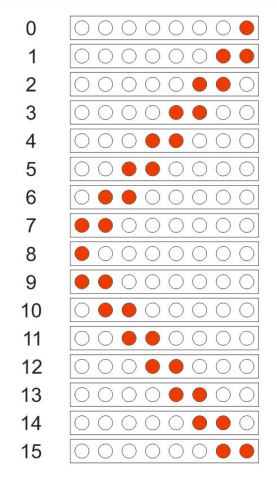

# TP3

## El auto fantástico. 

Utilizando un Arduino Nano (`atmega328p`), `8 LEDs` y `4 Pulsadores` se pide:

1. Al presionar el `pulsador 1` se **enciende** o se **apaga** el efecto.

2.  Al presionar los `pulsadores 2` y `3` **simultáneamente** *Baja* la velocidad del efecto.

3. Al presionar los `pulsadores 2` y `4` **simultáneamente** *Sube* la velocidad del efecto.

## Estados


> Nota: Todos los pulsadores `deben` tener habilitada la resistencia de `pull-up`.

> Utilice Flags para no tener que mantener presionado los botones al cambiar de velocidad y que no aumente o disminuya de a varios niveles a la vez. 

> Asi mismo los LEDs deben conectarse con su resistencia limitadora de corriente asegurando no superar la corriente máxima que puede entregar el pin. Al menos de 330 Ohms.

## ¡USAR LOS PINES INDICADOS NO CAMBIARLOS!

``` C
PC0 -> BOTON 1 
PC1 -> BOTON 2 
PC2 -> BOTON 3 
PC3 -> BOTON 4

PD2 -> LED 1   
PD3 -> LED 2 
PD4 -> LED 3
PD5 -> LED 4 
PD6 -> LED 5 
PD7 -> LED 6
PB0 -> LED 7
PB1 -> LED 8

```
## Pinout


## Circuito

